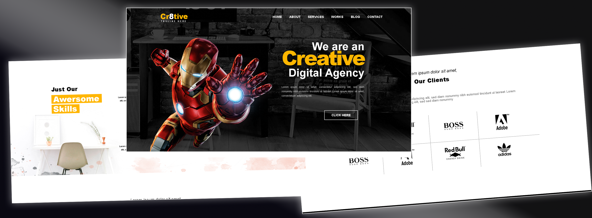

# WebSite Creative

> Projeto feito durante o 2º semestre de Ciências da computação, na cadeira de Web design. Projeto feito com base em um layout png (sem responsividade)

## Tecnologias utilizadas
- HTML 5
- CSS 3
- Padrão UX/UI

## Versão WEB
- Para ver a versão web, clique [aqui](https://guilhermeamariho.github.io/creative)

## Imagens

- Apresentação do projeto feito

